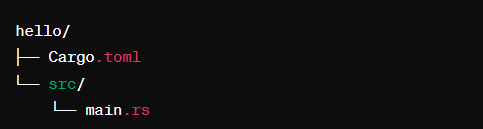
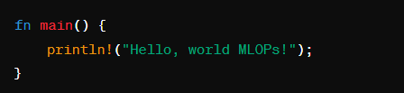
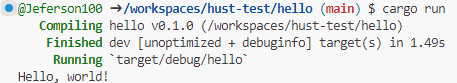
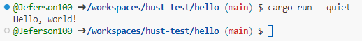
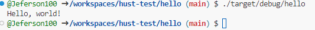

# hust-test

Crie um diretório de projeto: cargo new hello. O comando cargo cria uma estrutura que você pode ver com tree hello:

## Cargo.toml
O arquivo Cargo.toml é onde a configuração do projeto reside, ou seja, se você precisa adicionar uma dependência. O arquivo de código fonte tem o seguinte conteúdo em main.rs. 

## Main.rs
O arquivo main.rs com tem o codigo para rodar:

## Rodar o codigo
Para rodar va até o diretorio que o arquivo main.rs estiver e rode o seguinte comando **cargo run**.

Execute sem todo o barulho **cargo run --quiet**

Se você quiser executar o binário criado, o seguinte comando faz isso: **./target/debug/hello**

